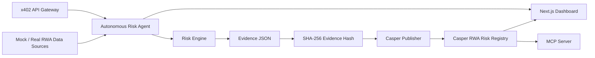

# RWA Risk Sentinel — Casper Agentic Buildathon 2026

**One-liner:** an autonomous RWA risk oracle that monitors off-chain asset signals, creates explainable risk attestations, and publishes evidence hashes + risk scores to Casper Testnet.

This repository is designed to be iterated quickly with Codex and to maximize the odds of a strong DoraHacks submission: clear product story, working local demo, contract-first architecture, agentic workflow, frontend dashboard, and a concrete path to real Casper Testnet transactions.

## Why this project is competitive

Most hackathon submissions look like “AI chatbot + blockchain.” **RWA Risk Sentinel** is closer to a product:

- **Agentic AI loop:** the agent observes, scores, explains, decides, and publishes without a manual button-click flow.
- **RWA/DeFi fit:** lending protocols, tokenized invoices, real-estate notes, carbon credits, treasury assets, and insurance pools need continuous off-chain monitoring.
- **On-chain utility:** the Casper contract stores compact attestations that other dApps can read.
- **Demo clarity:** judges can understand the value in under 90 seconds: “risk changed → evidence package generated → hash published on-chain → dashboard updates.”
- **Casper alignment:** the repo leaves clean integration points for Odra, Casper SDK, MCP, x402-style paid APIs, and CSPR.cloud.

## Product story

RWA protocols rely on off-chain facts: invoice status, payment delays, debtor risk, macro movement, registry updates, weather events, shipping data, or compliance flags. Those facts are fragmented and hard to trust.

**RWA Risk Sentinel** turns off-chain signals into verifiable on-chain attestations:

1. A scheduled autonomous agent fetches asset signals.
2. A risk engine computes a score, confidence, and explanation.
3. The agent packages the evidence as JSON and hashes it.
4. The publisher sends the attestation to Casper Testnet.
5. A dashboard and downstream smart contracts read the latest score.

## Architecture



## Monorepo layout

```txt
agent/                         Python FastAPI autonomous agent + tests
contracts/rwa_risk_registry/   Odra-style Casper smart contract starter
data/sample_signals/           Demo input datasets for repeatable judge demos
docs/                          Pitch, demo script, architecture, judging strategy
frontend/                      Next.js dashboard scaffold
mcp-server/                    MCP server scaffold for agent/blockchain tools
scripts/                       Setup, demo cycle, deploy/publish placeholders
x402-gateway/                  Paid API gateway scaffold
```

## Quick start — local end-to-end demo

1. **Setup the Environment**:
   Initialize the Python virtual environment and install the required FastAPI and backend dependencies (uses Python 3.13 to prevent compilation errors):
   ```bash
   make setup
   ```

2. **Run Tests**:
   Ensure all Python and smart contract unit tests pass:
   ```bash
   # Run Python agent tests
   make test
   
   # Run Casper contract unit tests
   cd contracts/rwa_risk_registry && cargo odra test && cd ../..
   ```

3. **Start the Demo Application**:
   Run both the FastAPI backend and Next.js frontend concurrently using a single command:
   ```bash
   make dev
   ```

   Open [http://localhost:3000](http://localhost:3000) in your browser.

4. **Trigger Agent Runs via CLI**:
   In another terminal, trigger the repeatable risk oracle demo loop:
   ```bash
   make demo
   ```

## Demo API

```bash
curl http://localhost:8080/health
curl http://localhost:8080/assets/invoice-2026-001/preview
curl -X POST http://localhost:8080/agent/run \
  -H 'content-type: application/json' \
  -d '{"asset_id":"invoice-2026-001","dry_run":true}'
```

## Casper Testnet Integration

The Casper Testnet publisher is fully implemented in the Python agent using `casper-client` v5 CLI targeting the compiled `rwa_risk_registry` Odra smart contract.

To switch from the local mock publisher to real Casper Testnet publishing:
1. Refer to [docs/TESTNET_TRANSACTIONS.md](file:///Users/mathieu/Project/06_DoraHacks/casper-agentic-buildathon-repo/docs/TESTNET_TRANSACTIONS.md) for step-by-step key generation, account funding, contract deployment, and env configuration instructions.
2. Once the environment variables are configured in `agent/.env` (setting `CASPER_DRY_RUN=false`), all analysis runs will write real cryptographic risk attestations directly on-chain.

## Winning submission checklist

- [ ] Public GitHub repo with this README updated.
- [ ] Working prototype deployed on Casper Testnet.
- [ ] Transaction-producing on-chain component.
- [ ] Demo video under 3 minutes.
- [ ] DoraHacks project page with screenshots.
- [ ] Clear explanation of agentic loop.
- [ ] Clear explanation of DeFi/RWA use case.
- [ ] Future roadmap: MCP server, x402 monetization, multi-agent validation, reputation/slashing.

## The pitch in one paragraph

RWA Risk Sentinel is an autonomous risk oracle for tokenized real-world assets on Casper. It continuously monitors off-chain signals, computes explainable risk scores, stores evidence off-chain, and publishes compact attestations on-chain so DeFi protocols can react to real-world changes. It demonstrates agentic AI, useful RWA infrastructure, transaction-producing Casper smart contracts, and a credible path to x402-paid risk APIs and MCP-enabled blockchain agents.

## License

MIT
